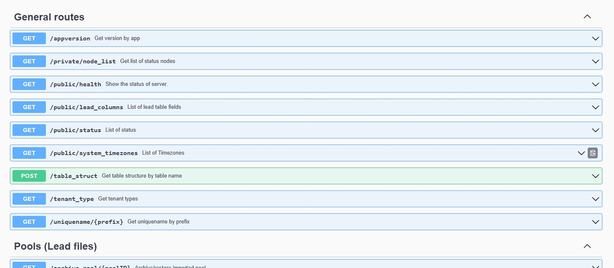

# CallEvo Api RestFul Demo

Developer Tools

 
 

## Installation
### Option 1. Install 
```
npm install 
```

# Api Documentation
### How to use this guide

First you must open the Api documentation. [`http://616262.ip.hamvoip.org:8082/doc/index.html#/`](http://616262.ip.hamvoip.org:8082/doc/index.html#/)

In the documentation it indicates how the path is defined and the requirements it has.

For this demo each path can be found in the `./src/` folder and is subdivided in groups, and they are the same as in the documentation. Ex: If the route says GET/appversion inside General Routes then the corresponding demo file is in `./src/general/get-appversion.js` or `./src/general/public/get-node_list`.



# Important
1. The following files are important for the correct functioning of the demo:
```
.env -> Environment Variables
```
```
API_PATH=http://616262.ip.hamvoip.org:8082/api/v2/
APP_TOKEN=<token>
```
2. Each file has a working code example that works without problems. 
3. When the file is run, the result is saved in the `results` folder.

# Execute Demo

1. You must to select a route and group: Ex: `General/GET/appversion`
2. Run
```
node /src/general/get-appversion.js
```
3. Response
```js
Successful request
Response: {'action': 'appversion', 'data': {'appversion': 'v1.250'}, 'id': '', 'message': '', 'result': 'OK'}
```
# Check if the api is healthy
```
node /src/general/get-health.js 
```
Result
```js
Successful request
Data: {'action': 'checkhealth', 'id': '', 'message': 'Healthy', 'result': 'OK'}
```

# What routes should I follow to be able to dial 
<a id="menu"></a>
To start to dial you must following some steps:
|Step|Description|Actions|Command to run|
|---|---|---|---|
|1|Callevo Administration gives you a token which you must paste into an environment variable file in the .env file. | [+Info](/doc/create_environment_file.md) ||
|2|Create a users (agents/clickers) and obtain the `userid` <br>Ex: {..."message": 12} from response|[+Info](/doc/users.md)<br>[Edit](/src/users/post-user.js)|node src/users/post-user.js|
|3|Collect user data by getting the `agent_code` and `agentid` field|[Edit](src/users/get-users-id.js)|node src/users/get-users-id.js|
|4|Create a team and paste the `agent_code` into the interface field => "Agent/<agent_code>"|[+Info](/doc/teams.md)<br>[Edit](/src/teams/post-team.js)|node src/teams/post-team.js|
|5|Collect team data by queue_id to get the `name` field, <br> Ex: `{..name: "q282fpqah33qky3s8egq90"}`|[Edit](/src/teams/get-teams-id.js)|node src/teams/get-teams-id.js|
|6|Create a phone and obtain the `phoneid` from response {message: '1852'}|[+Info](/doc/phones.md)<br>[Edit](/src/phones/post-phone.js)|node src/phones/post-phone.js|
|7|Create a caller ID group with the obtained phoneIDs. After executing you can get the `groupid` <br> Ex: {'message': '315'}|[+Info](/doc/calleridgroups.md)<br>[Edit](src/caller-id-groups/post-caller-id-group.js)|node src/caller-id-groups/post-caller-id-group.js|
|8|Import a recording and get the `recID` of the response {message: '100'}|[+Info](/doc/recordings.md)<br>[Edit](/src/recordings/post-systemrecording.js)|node src/recordings/post-systemrecording.js|
|9|Create a campaign and obtain the `camp_id`.<br> Optional: you can complement the campaign information by filling the fields with data obtained in previous routes such as: groupid, name (team name), initialrecordID/finalrecordID with the recID|[+Info](/doc/campaigns.md)<br>[Edit](/src/campaigns/post-campaign.js)|node src/campaigns/post-campaign.js|
|10|Upload the file containing the numbers to make the calls.<br>You must paste the file in the `files` folder.|[+Info](/doc/pools.md)<br>[Edit](/src/pools/post-pool.js) |node src/pools/post-pool.js|
|11|Import data from file uploaded.<br>You can see the result with the following information: `{'dedup': 0, 'elegibles': 0, 'error': 0, 'merge': 1499, 'scrub': 0, 'upload': 1499}` |[Edit](/src/pools/post-file-import-id.js)|node src/pools/post-file-import-id.js
|12|Start file imported|[Edit](/src/pools/post-start-pool-id.js)|node src/pools/post-start-pool-id.js
|13|Start a campaign


# Important route management documentation
1. [Users](/doc/users.md)
1. [Teams (projets groups)](/doc/teams.md)
1. [Numbers / Phones](/doc/phones.md)
1. [Caller ID Groups](/doc/calleridgroups.md)
1. [Campaigns (Projects)](/doc/campaigns.md)
1. [File Templates](/doc/filetemplates.md)
1. [Import files (Pools)](/doc/pools.md)
1. [Recordings](/doc/recordings.md)
1. [Tenants](/doc/tenants.md)
1. TimesZones

# More examples

### Users

| Description | Route | Command
|-------------|-------|---------|
|Get a list of my tenant's users|`GET/users`|`node src/users/get-users.js`|
|Get a specific user|`GET/users/2012`|`node src/users/get-users-id.js`| 
|Create a new user|`POST/user`|`node src/users/post-user.js`|  
|Update a user|`PUT/user/2012`|`node src/users/put-user-id.js`|
|Delete a user | `DELETE/user/2012` | `node src/users/delete-user-id.js` |

# Testing Example
*Step 1*. ok, I created the .env file and put the token inside.

*Step 2*. Create a users<br>
```c
    node src/users/post-user.js
```
```json
    {, 'message': '15315',} --> userid = 15315
    {, 'message': '15313',} --> userid = 15313
    {, 'message': '15314',} --> userid = 15314
```
*Step 3*. Collect a users data
```c
    node src/users/get-users-id.js
```
```c
    15315   agent_code=u282xdaw7ahwzfz5gsht    agentid=15337
    15313   agent_code=u282ms5xpeg5m696zckb    agentid=15338 
    15314   agent_code=u2822htb7mp0d8rnehrd    agentid=15339
```
*Step4*. Create a team
```c
    node src/teams/post-team.js
```
```c
    queue_id = 10211
```
*Step 5*. Collect a team data
```c
    node src/teams/get-teams-id.js
```
```c
    name = q282ubzotmgr12bss9zb
```
*Step 6*. Create phones
```c
    node src/phones/post-phone.js
```
```c
    phoneid = 18003
```
*Step 7*. Create CallerIDGroup
```c
    node src/caller-id-groups/post-caller-id-group.js
```
```c
    groupid = 316
```
*Step 8*. Import a recording
```c
   node src/recordings/post-systemrecording.js 
```
```c
    recID = 37
```
*Step 9*. Create a campaign 
```c
    node src/campaigns/post-campaign.js
```
```c
    camp_id = 1800
```
*Step 10*. Upload a file to import
```c
    node src/pools/post-pool.js
```
```c
    poolid = 2621
```
*Step 11*. Import file uploaded
```c
    node src/pools/post-file-import-id.js
```
```c
    {'dedup': 0, 'elegibles': 0, 'error': 0, 'merge': 1499, 'scrub': 0, 'upload': 1499}
```
*Step 12*. Start file
```c
    node src/pools/post-start-pool-id.js
```
```c
    {'action': 'start_pool', 'data': {}, 'id': '', 'message': '', 'result': 'OK'}
```

